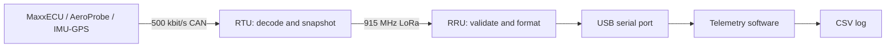

# GRC26 telemetry system

The telemetry system carries vehicle CAN measurements to a computer in the pits.
[RTU/GRC26.dbc](RTU/GRC26.dbc) is the source of truth for its 16 CAN messages and
40 signals. The DBC defines their bit positions, signedness, scaling and units.

## Components and data flow



- **RTU** (`RTU/`): receives CAN frames, maintains the latest value and receipt
  time for each source, and sends scheduled radio snapshots.
- **RRU** (`RRU/Embedded/`): receives radio packets, validates them, and prints
  one CSV row per packet.
- **Telemetry software** (`RRU/Software/`): reads the RRU's serial port, validates
  each telemetry row, and writes a CSV log.

The RTU acquisition task does not generate ECU or sensor CAN messages. CAN input
is sampled into snapshots; radio telemetry does not forward every raw CAN frame.
The RTU's CAN and LoRa tasks have 4,096-byte stacks and priorities 3 and 2. A
24-entry FIFO connects them. Each item is 53 bytes, requiring 1,272 bytes of item
storage plus queue overhead. The RRU has one radio task at priority 1 with a
4,096-byte stack and a reusable 1,536-byte CSV buffer.

## Hardware and settings

Both projects target `esp32-s3-devkitc-1`, using the Arduino framework, PlatformIO
and RadioLib. The radio is an LR1121. USB CDC is enabled at boot. Serial
initialization, the monitor and desktop defaults are 115200 baud.

| Connection | RTU GPIO | RRU GPIO |
| --- | --- | --- |
| SPI MOSI | 11 | 11 |
| SPI clock | 12 | 12 |
| SPI MISO | 13 | 13 |
| Radio chip select | 16 | 16 |
| Radio reset | 17 | 36 |
| Radio busy | 18 | 35 |
| CAN TX | 47 | Not used |
| CAN RX | 48 | Not used |

Each project's `include/Defines/PinDefs.h` defines its pins. The radio IRQ pin is
not routed; the API polls interrupt flags over SPI. The TCXO setting is 1.6 V.
`LoRaAPI.cpp` configures the RF switch using DIO5/DIO6/DIO7.

| Setting | Value |
| --- | --- |
| CAN speed / mode | 500 kbit/s / TWAI normal mode |
| Frequency | 915 MHz |
| Bandwidth | 500 kHz |
| Spreading factor | 6 |
| Coding rate | 4/5 |
| Transmit power | 14 dBm |
| Preamble | 12 symbols |
| Sync word | RadioLib LR11x0 private LoRa sync word |
| Header / PHY CRC | Explicit / enabled |
| Inter-packet transmit gap | 3 ms |
| Transmit polling interval | 2 ms |
| RRU polling interval | One RTOS tick, 1 ms in this build |
| Receive timeout | 5,000 ms, followed by rearming |

Both radios must use matching settings. The API limits each transmission to
approximately 1.5 times its calculated airtime plus 500 ms. The tasks yield while
radio operations are busy.

## Signals

The RTU accepts supported standard CAN data frames with exactly eight payload
bytes. Extended frames, remote requests, unsupported identifiers, null payloads
and incorrect lengths leave state unchanged. Multibyte DBC signals are little
endian. Raw integers retain their signedness and range without silent clamping.
Radio storage follows the DBC scale; CSV presents engineering values.

| CAN ID | DBC signal | Serial column | Unit | Packet |
| --- | --- | --- | --- | --- |
| `0x520` | EngineSpeed | `rpm` | rpm | FAST |
| `0x520` | ThrottlePos | `tps_pct` | % | FAST |
| `0x520` | Lambda_Average | `lambda_avg` | lambda | FAST |
| `0x521` | Lambda_A | `lambda_a` | lambda | SLOW |
| `0x521` | Lambda_B | `lambda_b` | lambda | SLOW |
| `0x522` | FuelInjPulsewidth | `fuel_inj_pulse_width_ms` | ms | SLOW |
| `0x522` | FuelInjDuty | `fuel_inj_duty_pct` | % | SLOW |
| `0x522` | VehicleSpeed | `vehicle_speed_kph` | km/h | FAST |
| `0x526` | Knock_detected | `knock_detected` | 0/1 | FAST |
| `0x526` | Brake_pedal_active | `brake_pedal_active` | 0/1 | FAST |
| `0x526` | Clutch_pedal_active | `clutch_pedal_active` | 0/1 | FAST |
| `0x526` | RevLimit_RPM | `rev_limit_rpm` | rpm | FAST |
| `0x527` | Lambda_Target | `lambda_target` | lambda | SLOW |
| `0x530` | ECU_BatteryVoltage | `battery_v` | V | FAST |
| `0x530` | IntakeAirTemp | `intake_air_temp_c` | degC | SLOW |
| `0x530` | CoolantTemp | `coolant_temp_c` | degC | SLOW |
| `0x536` | GearPosn | `gear` | DBC raw value | FAST |
| `0x538` | User_Channel_1 | `user_channel_1` | Unspecified | FAST |
| `0x600` | AeroProbe_Pressure_1 | `aero_pressure_1_pa` | Pa | SENSORS |
| `0x600` | AeroProbe_Pressure_2 | `aero_pressure_2_pa` | Pa | SENSORS |
| `0x601` | AeroProbe_AmbientTemp | `aero_ambient_temp_c` | degC | SENSORS |
| `0x601` | AeroProbe_AmbientPressure | `aero_ambient_pressure_hpa` | hPa | SENSORS |
| `0x602` | AeroProbe_NodeState | `aero_node_state` | State code | SENSORS |
| `0x602` | AeroProbe_SensorFlags | `aero_sensor_flags` | Bitmask | SENSORS |
| `0x602` | AeroProbe_FaultFlags | `aero_fault_flags` | Bitmask | SENSORS |
| `0x602` | AeroProbe_Sequence | `aero_sequence` | Counter | SENSORS |
| `0x610` | Accel_Longitudinal | `acceleration_x_g` | g | SENSORS |
| `0x610` | Accel_Lateral | `acceleration_y_g` | g | SENSORS |
| `0x610` | Accel_Vertical | `acceleration_z_g` | g | SENSORS |
| `0x611` | YawRate | `yaw_rate_dps` | deg/s | SENSORS |
| `0x611` | PitchRate | `pitch_rate_dps` | deg/s | SENSORS |
| `0x611` | RollRate | `roll_rate_dps` | deg/s | SENSORS |
| `0x612` | ImuGps_NodeState | `imu_node_state` | State code | SENSORS |
| `0x612` | ImuGps_SensorFlags | `imu_sensor_flags` | Bitmask | SENSORS |
| `0x612` | ImuGps_FaultFlags | `imu_fault_flags` | Bitmask | SENSORS |
| `0x612` | ImuGps_Sequence | `imu_sequence` | Counter | SENSORS |
| `0x620` | GPS_Latitude | `gps_latitude_deg` | deg | SENSORS |
| `0x620` | GPS_Longitude | `gps_longitude_deg` | deg | SENSORS |
| `0x621` | GPS_GroundSpeed | `gps_ground_speed_kph` | km/h | SENSORS |
| `0x621` | GPS_Course | `gps_course_deg` | deg | SENSORS |

`User_Channel_1` has scale 0.1 and no DBC physical unit. Identify its actual MTune
assignment before interpreting it as a vehicle measurement. Acceleration X/Y/Z
means longitudinal/lateral/vertical. GPS preserves seven decimal places. Node
states are 0=Boot, 1=Healthy, 2=Degraded, 3=Fault; other raw values remain
transportable. Sensor/fault bitmasks are owned by the corresponding nodes.

## Receipt, freshness and scheduling

Each source is independent. Snapshots begin even before any CAN message arrives.
CAN waits are bounded by the next deadline, at most 20 ms in the configured build.
No source or complete message set is required for other telemetry to proceed.

Each packet carries `received_mask` and `fresh_mask`. Receipt means a valid frame
arrived since RTU boot; freshness means its most recent frame arrived at most
2,000 ms before the snapshot. Fresh bits must be a subset of received bits.

| Bit | CAN ID | Message |
| --- | --- | --- |
| 0 | `0x520` | ECU_ENGINE_1 |
| 1 | `0x521` | ECU_LAMBDA |
| 2 | `0x522` | ECU_FUEL_SPEED |
| 3 | `0x526` | ECU_STATUS |
| 4 | `0x527` | ECU_LAMBDA_TARGET |
| 5 | `0x530` | ECU_ENVIRONMENT |
| 6 | `0x536` | ECU_GEAR |
| 7 | `0x538` | ECU_USER_CHANNELS_1 |
| 8 | `0x600` | AEROPROBE_PRESSURES |
| 9 | `0x601` | AEROPROBE_AMBIENT |
| 10 | `0x602` | AEROPROBE_STATUS |
| 11 | `0x610` | IMU_ACCELERATION |
| 12 | `0x611` | IMU_ANGULAR_RATE |
| 13 | `0x612` | IMU_GPS_STATUS |
| 14 | `0x620` | GPS_POSITION |
| 15 | `0x621` | GPS_MOTION |

All sources received is `0xFFFF`; none is `0x0000`. Missing measurements are blank
in CSV. Stale measurements retain their values with fresh
bits clear. Zero is a valid measurement when its receipt bit is set. Receipt
alone does not prove sensor health or GPS fix quality; node status carries the
information those nodes define.

Deadlines preserve phase. When late, the CAN task sends one current snapshot per
due type and skips missed slots. Queue sends use timeout zero and drop the newest
packet when full. Sequence numbers advance even on drops. CAN silence leaves
snapshots running while freshness expires.

The RRU captures metadata and rearms reception before CSV formatting/printing.
It maintains no combined state and prints each packet once. Rows of different
packet types contain different measurements. Use each row's `tx_ms`, `rx_ms` and
source masks when analyzing a log. RTU and RRU uptimes are separate wrapping
clocks. When radio traffic stops, the RRU produces no measurement rows.

## Radio protocol

| Byte offset | Length | Meaning |
| --- | --- | --- |
| 0 | 2 | Magic `54 4D` (`TM`) |
| 2 | 1 | Protocol identifier `03` |
| 3 | 1 | Packet type |
| 4 | 1 | Body length |
| 5 | Body length | Body |
| 5 + body length | 2 | Little-endian CRC16-CCITT |

CRC uses polynomial `0x1021`, initial value `0xFFFF`, no reflection/final XOR,
and covers the five envelope bytes and body. Total length is body length plus
seven. The receiver checks protocol identifier, type, exact length, CRC and masks
before exposing measurements.

All bodies start with `ms` (u32), `seq` (u16), `received_mask` (u16), and
`fresh_mask` (u16), occupying bytes 0-9. Integers are little-endian without padding;
signed values use two's complement. `ms` is RTU uptime at snapshot creation.
`seq` is shared across types and wraps at 65,536. Identical `TelemetryProtocol.h`
files in RTU and RRU define the layouts.

| Packet | Type | Body / frame bytes | Scheduled interval | Approx. airtime |
| --- | --- | --- | --- | --- |
| FAST | 1 | 28 / 35 | 20 ms (50 Hz) | 11.680 ms |
| SLOW | 2 | 24 / 31 | 2,000 ms (0.5 Hz) | 10.400 ms |
| EVENT | 3 | 26 / 33 | Status changes | 11.040 ms |
| SENSORS | 5 | 52 / 59 | 200 ms (5 Hz) | 16.800 ms |

Remaining body fields follow these exact orders. Divide `x10`, `x100`, `x1000`
and `x1e7` values by those multipliers for engineering units. Divide acceleration
in `mg` by 1,000 for g.

FAST, all u16:

```text
rpm, tps_x10, lambda_avg_x1000, vehicle_speed_kph_x10, status_bits,
rev_limit_rpm, gear, user_channel_1_x10, battery_v_x100
```

SLOW:

```text
lambda_a_x1000 u16, lambda_b_x1000 u16, lambda_target_x1000 i16,
fuel_inj_pulse_width_ms_x100 u16, fuel_inj_duty_x10 u16,
intake_air_temp_c_x10 u16, coolant_temp_c_x10 u16
```

SENSORS:

```text
aero_pressure_1_pa i16, aero_pressure_2_pa i16,
aero_ambient_temp_c_x100 i16, aero_ambient_pressure_hpa_x10 u16,
aero_node_state u8, aero_sensor_flags u8, aero_fault_flags u16, aero_sequence u8,
acceleration_x_mg i16, acceleration_y_mg i16, acceleration_z_mg i16,
yaw_rate_dps_x100 i16, pitch_rate_dps_x100 i16, roll_rate_dps_x100 i16,
imu_node_state u8, imu_sensor_flags u8, imu_fault_flags u16, imu_sequence u8,
gps_latitude_deg_x1e7 i32, gps_longitude_deg_x1e7 i32,
gps_ground_speed_kph_x100 u16, gps_course_deg_x100 u16
```

EVENT:

```text
alert_flags u16, status_bits u16, rpm u16,
aero_node_state u8, aero_sensor_flags u8, aero_fault_flags u16, aero_sequence u8,
imu_node_state u8, imu_sensor_flags u8, imu_fault_flags u16, imu_sequence u8
```

`status_bits` contains DBC states at bit 7 (knock), 8 (brake) and 9 (clutch).
RevLimit_RPM is a separate measurement. `alert_flags` identifies triggers: bit 0
ECU status changed, bit 1 AeroProbe status changed, bit 2 IMU/GPS status changed.
Node state/sensor/fault flags participate; sequence increments alone do not.
An initial nonzero status can trigger against the zero-initialized baseline.
Baselines advance on observation even if an event is dropped. Events carry
current snapshots of their included fields, with ordinary receipt masks.

The RTU radio buffer holds 96 bytes. Periodic traffic uses about 673.2 ms of RF
airtime per second. Adding 3 ms between its 55.5 packets per second gives about
83.97% modeled occupancy before polling, setup and events. The profile's estimate
is `airtime_ms = 0.128 * (26.25 + 5 * ceil((8 * frame_bytes + 12) / 24))`.
Source rates, queueing, bursts and RF loss affect delivery. Hardware throughput
and range need board testing; a host that stops draining serial can cause loss.

## Serial output

The RRU prints its 56-column header once after successful radio initialization.
Every row contains the same positions: 40 DBC signals and 16 fields for timing,
source validity, radio reception, status representation and errors. Exact order,
wrapped here for readability:

```text
event,rx_count,rx_ms,rssi_dbm,snr_db,radio_len,packet_type,seq,tx_ms,
schema_version,received_mask_hex,fresh_mask_hex,alert_flags_hex,status_bits_hex,
error_code,error_text,rpm,tps_pct,lambda_avg,lambda_a,lambda_b,
fuel_inj_pulse_width_ms,fuel_inj_duty_pct,vehicle_speed_kph,knock_detected,
brake_pedal_active,clutch_pedal_active,rev_limit_rpm,lambda_target,battery_v,
intake_air_temp_c,coolant_temp_c,gear,user_channel_1,aero_pressure_1_pa,
aero_pressure_2_pa,aero_ambient_temp_c,aero_ambient_pressure_hpa,aero_node_state,
aero_sensor_flags,aero_fault_flags,aero_sequence,acceleration_x_g,acceleration_y_g,
acceleration_z_g,yaw_rate_dps,pitch_rate_dps,roll_rate_dps,imu_node_state,
imu_sensor_flags,imu_fault_flags,imu_sequence,gps_latitude_deg,gps_longitude_deg,
gps_ground_speed_kph,gps_course_deg
```

Valid rows use `event=rx_packet`, their packet type, and `schema_version=3`.
`tx_ms` is the transmitted snapshot time. `rx_ms` is RRU uptime at receive
completion. RSSI/SNR describe that radio packet, and `radio_len` includes envelope
and CRC. `rx_count` counts completed radio receives, including radio-valid packets
rejected by application validation. Source masks, event flags and the status word
print as hexadecimal strings; node flags print as decimal integers. The status
word and the three individual ECU boolean columns represent the same DBC states.

Only received sources and fields carried by that packet are populated. FAST has
11 DBC signals, SLOW 7 and SENSORS 22. EVENT repeats RPM, the three ECU states and
both node status groups. The receiver never waits to fill empty cells from other
packets. The [sample CSV](RRU/Software/samples/sample_rx.csv) uses synthetic CAN
values formatted through the firmware, with one example of each packet type.

Error rows use `event=rx_error`, `packet_type=UNKNOWN`, receiver metadata and
`error_code`/`error_text`; sender metadata and measurements are blank. Radio
failures use API codes, decoding failures code -5 and CSV formatting failures -6.
Quiet receive timeouts print nothing. Task creation, radio initialization, RX
interrupt or receive cleanup failures can also print diagnostic text; desktop
parsers ignore those text lines.

## Build, flash and operate

From the repository root with PlatformIO installed:

```powershell
pio run -d RTU
pio run -d RRU/Embedded
pio run -d RTU -t upload --upload-port COM5
pio run -d RRU/Embedded -t upload --upload-port COM7
pio device monitor -d RRU/Embedded --port COM7 --baud 115200
```

Replace the ports with the boards' actual ports. The RTU defaults to real CAN
(`TELEMETRY_MOCK_DATA=0`, `LORA_ROLE_TX=1`); the RRU runs its receiver task.
Configuration lives in each project's `platformio.ini`, `Telemetry.h`,
`PinDefs.h` and `LoRaAPI.cpp`.

For bench operation without CAN, add `-DTELEMETRY_MOCK_DATA=1` to RTU build flags
and flash it. Mock mode initializes no CAN driver and feeds all 16 sources through
the decoder. Measurements change each second and repeat after a minute; node
sequence bytes continue wrapping. Startup prints
`[CAN][MOCK] Enabled: generated telemetry -> LoRa; CAN disabled`.
Restore the flag to zero for vehicle operation.

`LORA_ROLE_TX=0` with mock disabled provides an RTU diagnostic receive mode that
validates packets and prints masks/raw bodies. The RRU provides structured CSV.

Install the telemetry software from `RRU/Software` and start CSV logging:

```powershell
python -m venv .venv
.venv\Scripts\Activate.ps1
python -m pip install -e .
grc-lora-csv COM7 logs/session.csv --baud 115200 --print-rows
```

On Linux/macOS activate `.venv/bin/activate` and use the serial device path.
Only one application should own the serial port; close the serial monitor before
starting the telemetry software.

The logger creates the output directory and writes to the specified CSV path.
Use a separate filename for each session, as starting the logger replaces that
file. Each accepted row is flushed to disk immediately. `--print-rows` also prints
accepted rows to the terminal; `--verbose` shows ignored input. Stop with Ctrl+C.
Serial reads have a one-second timeout and resume when data arrives. Every packet
is processed independently, without waiting for other packet types or CAN sources.

The parser accepts the complete current header with `event` first and the remaining
columns in any order. When attached after the boot header, it can infer canonical
order from a complete 56-column row. Incompatible headers, unsupported packet
schemas and malformed rows are
rejected. The logger writes the header describing accepted data and records
`rx_packet` rows, preserving the RRU's values, empty cells and timing fields.
Inspect `rx_error` rows and diagnostic text with the serial monitor or `--verbose`
output.

## Verification and troubleshooting

From the repository root:

```powershell
powershell -ExecutionPolicy Bypass -File RTU/test/run_native_tests.ps1
powershell -ExecutionPolicy Bypass -File RRU/Embedded/test/run_native_tests.ps1
python -B RTU/test/test_dbc_pipeline.py
$env:PYTHONPATH = 'RRU/Software/src'
python -B -m unittest discover -s RRU/Software/tests -v
```

C++ runners require a C++11 compiler (`g++` by default); select it with
`-Compiler PATH`. The pipeline takes `--compiler PATH`. Products go in `.pio/`.
`-Sanitize` enables address/undefined-behavior sanitizers if supplied by the
compiler. Native tests also use inaccessible memory pages for buffer bounds.
Desktop tests require the installed software dependencies.

Tests cover all signals, signed extrema/scales, malformed frames, CRC/length/mask
checks, empty startup, each source missing, freshness and timer rollover, queue
drops, event baselines, polling/rearming, a minute of mock traffic, CSV/header
parity, serial parsing and CSV logging. The pipeline reads the DBC and exercises
actual RTU decoding/serialization through RRU decoding/formatting and host parsing. It
requires the measurement-column inventory to match the DBC exactly.

| Observation | Check |
| --- | --- |
| No RRU header | Port, radio initialization, task creation and radio wiring |
| Header but no data | RTU operation, matching RF settings, antennas, error diagnostics |
| Empty measurements | Receipt mask, CAN wiring/speed, supported identifiers and DLC |
| Values stop changing | Freshness mask, source health, snapshot and host arrival times |
| Missing packets | Sequence gaps, event load, RF conditions, queue capacity, serial draining |
| No desktop data | Port ownership, current header, schema identifier, row length, verbose output |
| Error row | `error_code`, `error_text` and related radio diagnostics |

Before vehicle use, confirm the CAN sources and MTune user-channel assignment,
then validate measurements and sustained reception on both boards. Firmware
builds and host tests establish software behavior, not physical CAN/RF performance.
